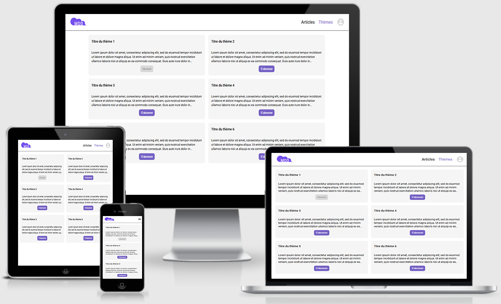

# Projet n°19 : Développer une application full-stack complète (partie front-end)

## :mag: Aperçu

## :bookmark_tabs: Sommaire

<ol>
    <li><a href="#sujet">Sujet</a></li>
    <li><a href="#demandes_respecter">Demandes à respecter</a></li>
    <li><a href="#objectifs_projet">Objectifs du projet</a></li>
    <li><a href="#technologies_utilisees">Technologies utilisées</a></li>
    <li><a href="#prerequis">Prérequis</a></li>
    <li><a href="#installation">Installation</a></li>
    <li><a href="#utilisation_siteweb">Utilisation du site web</a></li>
    <li><a href="#auteurs_contributeurs">Auteurs et contributeurs</a></li>
    <li><a href="#licence">Licence</a></li>
</ol>

## :page_facing_up: 1. Sujet 

Vous êtes recruté en tant que développeur full-stack dans une entreprise spécialisée dans le développement logiciel, ORION.

ORION souhaite créer le prochain réseau social dédié aux développeurs : MDD (Monde de Dév). Le but du réseau social MDD est d’aider les développeurs qui cherchent un travail, grâce à la mise en relation, en encourageant les liens et la collaboration entre pairs qui ont des intérêts communs. MDD pourrait devenir un vivier pour le recrutement des profils manquant des entreprises.

Avant de lancer MDD auprès d’un large public, l’entreprise veut le tester avec une version minimale déployée en interne (aussi nommé MVP : Minimum Viable Product).

Le MVP permettra aux utilisateurs de s’abonner à des sujets liés à la programmation (comme JavaScript, Java, Python, Web3, etc.). Son fil d’actualité affichera chronologiquement les articles correspondants. L’utilisateur pourra également écrire des articles et poster des commentaires.

Vous êtes responsable de la réalisation du MVP, mais vous ne serez pas seul, votre nouvelle équipe est prête à vous aider.

## :memo: 2. Demandes à respecter 

- Faire la partie front-end de l'application web en utilisant Angular.js ;
- L'application devra être responsive (s'adapter aux différentes tailles d'écrans) ;
- Utiliser des services pour réaliser les appels HTTP ;
- Utiliser RxJS et les observables ;
- Unsubscribe les observables ;
- Typer le code de manière à ne plus avoir de “any” ;
- Faire la partie back-end de l'application web en utilisant Java et Spring ;
- Mettre en place une authentification JWT via Spring Security ;
- Mettre en place une base de donnée avec une technologie au choix (H2, MySQL, etc...).

## :checkered_flag: 3. Objectifs du projet 

- Apprendre à utiliser Angular (gestion des composants, système de routing, utilisation de bibliothèques Angular, etc...) ;
- Apprendre à utiliser Java et Spring (initialisation d'une application Spring, mise en place de JWT, etc...).

## :computer: 4. Technologies utilisées 

- HTML
- CSS / Sass
- JavaScript / Angular.js
- Java
- Spring
- SQL
- Git & GitHub

## :exclamation: 5. Prérequis 

Avoir fait le necéssaire avec la partie back-end disponible ici :
https://github.com/LancelleTimote/Projet-n-19-Developper-une-application-full-stack-complete/tree/master/back

## :wrench: 6. Installation 

- Cloner ce repository ;
- Pour installer les différents packages, dans le terminal à partir du dossier front-end, exécuter npm install.

## :question: 7. Utilisation du site web 

- Dans le terminal à partir du dossier back-end, exécuter ChatopApplication présent dans src/main/java/com/chatop ;
- Dans le terminal à partir du dossier front-end, exécuter npm start ;
- L'application est disponible a l'adresse suivante : http://localhost:4200/
- L'API s'exécute sur le port 3001 ;
- Une fois l'API démarré, un Swagger est disponible à cette adresse : http://localhost:3001/swagger-ui/index.html
- La base de donnée H2 est disponible à cette adresse : http://localhost:3001/h2-console
- Les identifiants pour la base de donnée H2 sont :
  Username : sa
  Password : password
- Une fois sur l'application, vous devrez vous créer un compte, voici un exemple de remplissage des champs :
  email : test@test.com
  name : test TEST
  password : test!31

## :beers: 8. Auteurs et Contributeurs 

Timoté Lancelle : [GitHub](https://github.com/LancelleTimote) / [LinkedIn](https://www.linkedin.com/in/timote-lancelle-devweb/)

## :page_with_curl: 9. Licence 

Distribué sous la licence MIT. Voir le fichier [LICENSE](LICENSE) pour plus d'informations.
